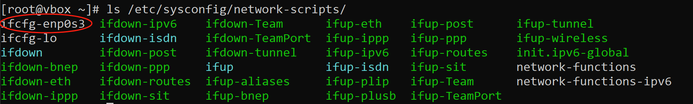
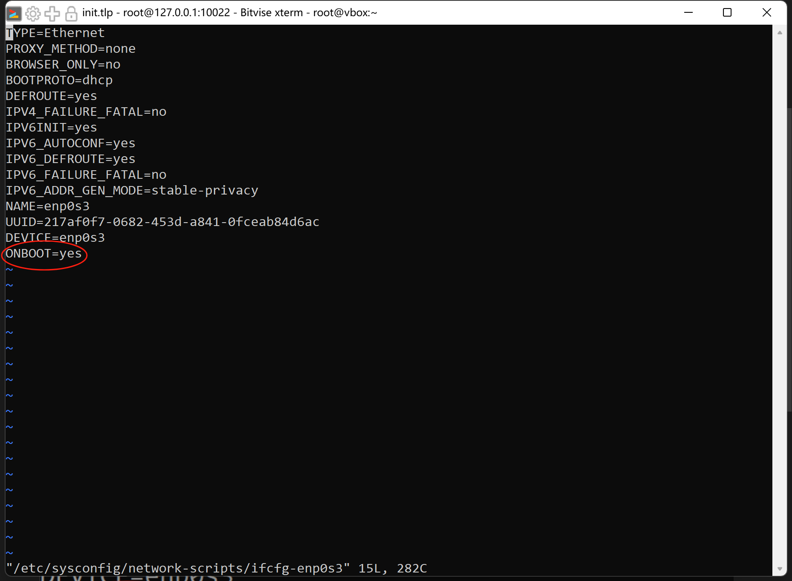

# Linux-Docker Examples

## Init

### Download 
> 1.ISO file 
2.Vbox 
3.Bitvise SSH Client

### Creat Virtual machine
Use the ISO file in Vbox to make your local virtual machine.

### Check your network
>ping www.baidu.com

use this sentence to check your network,for me,I can't connect net.

### Save network
>ls /etc/sysconfig/network-scripts/

use this sentence to check your network files,the first file is what you need.

Then open it and make ONBOOT to yes

>You can also change DNS,but it's not necessary.

### Finish Qusetion
Now you have network to ping,you can change these:
>vi /etc/yum.repos.d/CentOS-Base.repo
>
>可以通过 vi 命令编辑 /etc/yum.repos.d/CentOS-Base.repo 文件，将其中的 mirrorlist 行用 # 号注释掉，并将 baseurl 行取消注释，并修改为其他可靠的镜像地址。
>如将下图四个 baseurl 地址按顺序修改为阿里云的镜像地址：
>
>baseurl=http://mirrors.aliyun.com/centos/$releasever/os/$basearch/
baseurl=http://mirrors.aliyun.com/centos/$releasever/updates/$basearch/
baseurl=http://mirrors.aliyun.com/centos/$releasever/extras/$basearch/
baseurl=http://mirrors.aliyun.com/centos/$releasever/centosplus/$basearch/
>
>*原文链接：https://blog.csdn.net/weixin_52597907/article/details/141113817*

### Install docker
*congratulations!* You can install docker now! 
Now input these words:

**Set up the repository**

Install the package (which provides the utility) and set up the repository.

***yum-utils & yum-config-manager***

>sudo yum install -y yum-utils
>
>sudo yum-config-manager --add-repo https://download.docker.com/linux/centos/docker-ce.repo

**Install Docker Engine**

1.Install Docker Engine, containerd, and Docker Compose:
To install the latest version, run:

 >sudo yum install docker-ce docker-ce-cli containerd.io docker-buildx-plugin docker-compose-plugin

If prompted to accept the GPG key, verify that the fingerprint matches , and if so, accept it.
>060A 61C5 1B55 8A7F 742B 77AA C52F EB6B 621E 9F35

This command installs Docker, but it doesn't start Docker. It also creates a group, however, it doesn't add any users to the group by default.
2.Start Docker.

 >sudo systemctl start docker

3.Verify that the Docker Engine installation is successful by running the image.hello-world
 >sudo docker run hello-world

This command downloads a test image and runs it in a container. When the container runs, it prints a confirmation message and exits.